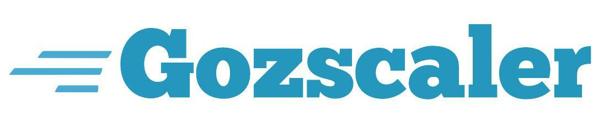

<a name="Gozscaler"></a>
[![Contributors][contributors-shield]][contributors-url]
[![Forks][forks-shield]][forks-url]
[![Stargazers][stars-shield]][stars-url]
[![Issues][issues-shield]][issues-url]
[![MIT License][license-shield]][license-url]


<!-- PROJECT LOGO -->
<br />
<div align="center">
  <a href="https://github.com/zepryspet/gozscaler">
    
  </a>

  <p align="center">
    SDK for zscaler public APIs for ZIA, ZPA and ZCC
    <br />
    <a href="https://pkg.go.dev/github.com/zepryspet/gozscaler"><strong>Explore the docs »</strong></a>
    <br />
    <br />
    <a href="https://github.com/zepryspet/gozscaler/issues">Report Bug</a>
    ·
    <a href="https://github.com/zepryspet/gozscaler/issues">Request Feature</a>
  </p>
</div>


<!-- TABLE OF CONTENTS -->
<details>
  <summary>Table of Contents</summary>
  <ol>
    <li>
      <a href="#about-the-project">About The Project</a>
      <ul>
        <li><a href="#built-with">Built With</a></li>
      </ul>
    </li>
    <li>
      <a href="#getting-started">Getting Started</a>
      <ul>
        <li><a href="#prerequisites">Prerequisites</a></li>
        <li><a href="#installation">Installation</a></li>
      </ul>
    </li>
    <li><a href="#usage">Usage</a></li>
    <li><a href="#roadmap">Roadmap</a></li>
    <li><a href="#contributing">Contributing</a></li>
    <li><a href="#license">License</a></li>
    <li><a href="#contact">Contact</a></li>
    <li><a href="#acknowledgments">Acknowledgments</a></li>
  </ol>
</details>


<!-- ABOUT THE PROJECT -->
## About The Project


Gozscaler is an sdk for zscaler public apis built purely in go and without 3rd party dependencies.

[![go][go.com]][go-url]

## Pre-requierements
* [Go version 1.18+]([go-url]) since go generics are used


ZPA sdk

* [Client secret and client api.](https://help.zscaler.com/zpa/zpa-api/api-developer-reference-guide) 
* Cloud name options:
    * config.private.zscaler.com
    * config.zpabeta.net

ZIA sdk
* Administrator & password
* [Api key](https://help.zscaler.com/zia/getting-started-zia-api)
* Cloud name options:
    * zscaler
    * zscloud
    * zscalerbeta
    * zscalerone
    * zscalertwo
    * zscalerthree

<p align="right">(<a href="#readme-top">back to top</a>)</p>


<!-- GETTING STARTED -->
## Getting Started


_Below is an example of how you can get started._

1. Create a new folder and add main.go file into it. 
    ```sh
    mkdir ztest
    cd ztest
    touch main.go
    go get github.com/zepryspet/gozscaler
    ```
2. Open the file `main.go` and add the following program that display your url rules
   ```go
    package main

    import (
        "fmt"
        "log"
        "github.com/zepryspet/gozscaler/zia"
    )

    func main() {
        c, err := zia.NewClient(cloudname, admin, password, apikey)
        if err != nil {
            log.Panic(err)
        }
        rules, err := c.GetUrlRules()
        if err != nil {
            log.Panic(err)
        }
        fmt.Println(rules)
    }
    ```
3. Init go.mod
    ```go
    go mod init
    go mod tidy
    ```
4. Run your program
    ```go
    go run main.go
    ```

<p align="right">(<a href="#readme-top">back to top</a>)</p>


<!-- USAGE EXAMPLES -->
## Usage

Use this space to show useful examples of how a project can be used. Additional screenshots, code examples and demos work well in this space. You may also link to more resources.

_For more examples, please refer to the [Documentation](https://example.com)_

<p align="right">(<a href="#readme-top">back to top</a>)</p>


<!-- ROADMAP -->
## Roadmap

- [ ] Release v1.0
- [ ] Add tests


See the [open issues](https://github.com/zepryspet/gozscaler/issues) for a full list of proposed features (and known issues).

<p align="right">(<a href="#readme-top">back to top</a>)</p>


<!-- CONTRIBUTING -->
## Contributing

Contributions are what make the open source community such an amazing place to learn, inspire, and create. Any contributions you make are **greatly appreciated**.

If you have a suggestion that would make this better, please fork the repo and create a pull request. You can also simply open an issue with the tag "enhancement".
Don't forget to give the project a star! Thanks again!

1. Fork the Project
2. Create your Feature Branch (`git checkout -b feature/AmazingFeature`)
3. Commit your Changes (`git commit -m 'Add some AmazingFeature'`)
4. Push to the Branch (`git push origin feature/AmazingFeature`)
5. Open a Pull Request

<p align="right">(<a href="#readme-top">back to top</a>)</p>


<!-- LICENSE -->
## License

Distributed under the MIT License. See `LICENSE.md` for more information.

<p align="right">(<a href="#readme-top">back to top</a>)</p>


<!-- MARKDOWN LINKS & IMAGES -->
<!-- https://www.markdownguide.org/basic-syntax/#reference-style-links -->
[contributors-shield]: https://img.shields.io/github/contributors/zepryspet/gozscaler?style=for-the-badge
[contributors-url]: https://github.com/zepryspet/gozscaler/graphs/contributors
[forks-shield]: https://img.shields.io/github/forks/zepryspet/gozscaler?style=for-the-badge
[forks-url]: https://github.com/epryspet/gozscaler/network/members
[stars-shield]: https://img.shields.io/github/stars/zepryspet/gozscaler?style=for-the-badge
[stars-url]: https://github.com/zepryspet/gozscaler/stargazers
[issues-shield]: https://img.shields.io/github/issues/zepryspet/gozscaler?style=for-the-badge
[issues-url]: https://github.com/zepryspet/gozscaler/issues
[license-shield]: https://img.shields.io/github/license/zepryspet/gozscaler?style=for-the-badge
[license-url]: https://github.com/zepryspet/gozscaler/blob/master/LICENSE.md
[go.com]: https://img.shields.io/badge/go-white?style=for-the-badge&logo=go
[go-url]: https://go.dev/dl/